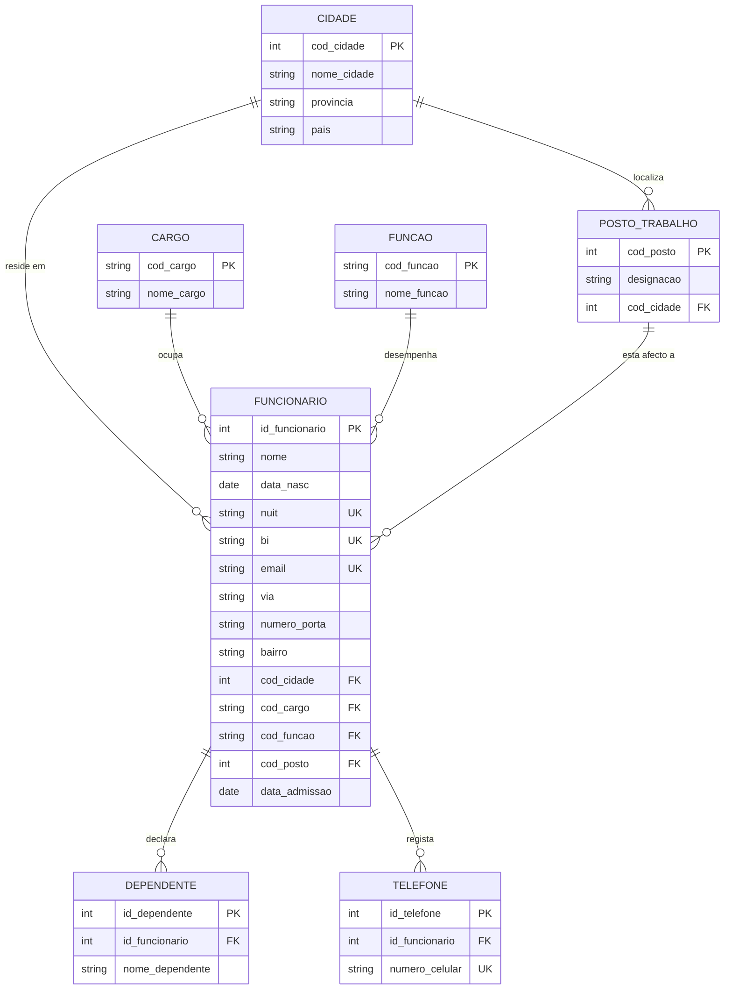
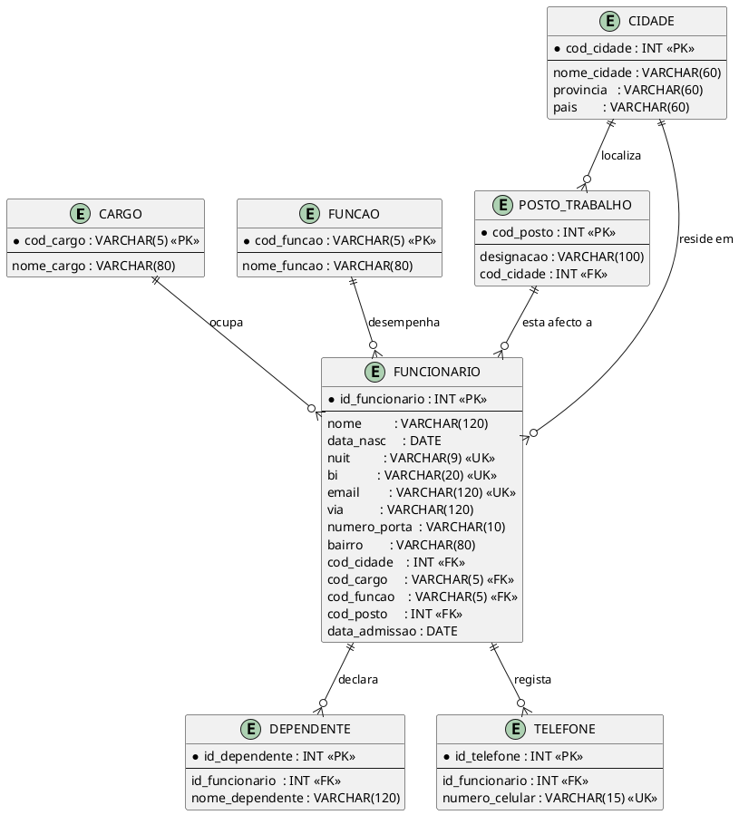

# TRABALHO II — Normalização de Base de Dados
## Sistema de Gestão de Funcionários

**Universidade Licungo — Faculdade de Ciências e Tecnologias**
**Curso de Licenciatura em Informática**
**Disciplina:** Tecnologias de Base de Dados
**Docente:** Daniel Berequeto Gimo
**Estudante:** João Chicava João Dojo
**Data:** Setembro de 2026

---

## Índice

1. Levantamento e Justificação das Anomalias (0FN)
2. Processo Gradual de Normalização (1FN → 4FN)
3. Cardinalidades e Regras de Negócio
4. Modelo Entidade-Relacionamento (MER/DER)

---

## 1. Levantamento e Justificação das Anomalias (0FN)

A tabela de partida (`Dados_Não_Normalizados_Funcionários`) reúne, numa única relação achatada, 16 registos de funcionários com 21 atributos: dados pessoais, morada, dados profissionais e dois grupos repetitivos (filhos e contactos telefónicos). Esta estrutura corresponde à **Forma Não Normalizada (0FN)** e apresenta quatro classes de problemas.

### 1.1 Dados não atómicos

O atributo **Endereço** viola o princípio da atomicidade — cada valor de domínio deve ser indivisível. Um único campo mistura três informações de granularidade distinta: via/avenida, número de porta e bairro.

> Exemplo real: `"Av. Julius Nyerere, n.º 245, Sommerschield"` (registo de Amélia Fernanda Cossa).

Consequências práticas: é impossível pesquisar todos os funcionários de um determinado bairro, ordenar por via, ou validar o número de porta isoladamente, sem recorrer a expressões de manipulação de texto (`SUBSTRING`, `LIKE`) — sintoma clássico de não atomicidade.

### 1.2 Grupos repetitivos e desperdício de espaço

Os blocos **Filho 1 / Filho 2 / Filho 3** e **Celular 1 / Celular 2 / Celular 3** são grupos repetitivos fixos:

| Funcionário | Filhos preenchidos | Células "Filho" vazias |
|---|---|---|
| Fernando José Macuácua | 3 | 0 |
| Domingos Paulo Nhantumbo | 2 | 1 |
| Amélia Fernanda Cossa | 1 | 2 |
| Celina Armando Sitoe, Graça Isabel Zunguze, Ivete Sara Chirindza, Noémia Alzira Massingue, Paulina Fátima Uache | 0 | 3 (cada) |

Este desenho gera dois problemas estruturais:
- **Desperdício de espaço** — cinco funcionários sem filhos ocupam, ainda assim, 3 colunas vazias (NULL) cada, o mesmo acontecendo com os telefones.
- **Inflexibilidade** — a tabela impõe um limite artificial de 3 filhos e 3 contactos. Um funcionário com um quarto filho (situação perfeitamente comum) não pode ser representado sem alterar a estrutura da tabela, o que é inaceitável num modelo relacional bem desenhado.

### 1.3 Anomalias de Inserção, Atualização e Remoção

**Anomalia de Inserção.** Não é possível registar um novo cargo (por exemplo, "Analista de Marketing", código C09) enquanto não existir pelo menos um funcionário contratado para essa função — o Cargo só "existe" no sistema como atributo dependente de Funcionário, não como entidade autónoma.

**Anomalia de Atualização.** O código de cargo `C01` ("Técnico de Informática") ocorre em dois registos (Amélia Fernanda Cossa e Ivete Sara Chirindza). Se a designação for revista para "Técnico de Tecnologias de Informação", a alteração tem de ser replicada manualmente em todas as linhas onde `C01` aparece; esquecer uma delas produz inconsistência entre registos que deveriam ser idênticos.

**Anomalia de Remoção.** O posto de trabalho "Delegação Nampula" está associado apenas a dois funcionários (Ivete Sara Chirindza e João Baptista Nhaca). Se, hipoteticamente, ambos fossem desvinculados e os seus registos eliminados, a informação de que a empresa possui uma delegação em Nampula — e a associação Cidade→Província→País correspondente — desapareceria por completo da base de dados, apesar de ser um facto organizacional independente da existência de funcionários.

### 1.4 Dependências Funcionais, Parciais, Transitivas e Multivaloradas

Tomando `ID_Funcionário` como chave candidata (surrogate), e `NUIT`, `BI` e `Email` como chaves candidatas alternativas (todas com unicidade garantida nos dados):

**Dependências funcionais completas** (atributo depende da chave inteira):

```
ID_Funcionário → Nome, Data_Nasc, NUIT, BI, Email, Via, Número_Porta, Bairro,
                 Cidade, Cód_Cargo, Cód_Função, Posto_Trabalho, Data_Admissão
```

**Dependências transitivas** (atributo não-chave depende de outro atributo não-chave, e não diretamente da chave primária):

```
Cód_Cargo   → Cargo
Cód_Função  → Função
Cidade      → Província → País
Posto_Trabalho → Cidade   (o posto está fisicamente localizado numa cidade)
```

**Dependências parciais** — visíveis se, ao "achatar" os grupos repetitivos, se construir uma chave composta `(ID_Funcionário, N.º_Filho)` para a tabela de filhos e `(ID_Funcionário, N.º_Celular)` para a de telefones. Nesse cenário, todos os atributos pessoais e profissionais do funcionário dependeriam apenas da **parte** `ID_Funcionário` da chave composta, e não da chave composta inteira — violação clássica da 2FN.

**Dependências Multivaloradas (DMV):**

```
ID_Funcionário  ↠  Nome_Filho
ID_Funcionário  ↠  Número_Celular
```

Estas duas DMVs são **independentes entre si**: o conjunto de filhos de um funcionário não tem qualquer relação com o conjunto dos seus contactos telefónicos. Combinar os dois grupos repetitivos numa mesma linha da tabela original é o que motiva o tratamento em 4FN (Secção 2.5).

---

## 2. Processo Gradual de Normalização

### 2.1 Primeira Forma Normal (1FN)

**Regra teórica.** Uma relação está em 1FN se e só se todos os seus atributos contêm valores atómicos (indivisíveis, de um único domínio) e não existem grupos de atributos repetitivos.

**Ações aplicadas:**
- Decomposição de **Endereço** em `Via`, `Número_Porta`, `Bairro`.
- Eliminação dos grupos repetitivos `Filho 1..3` e `Celular 1..3`: cada um passa a ser uma relação independente, com uma linha por ocorrência (filho ou telefone), ligada ao funcionário por chave estrangeira.

**Esquema resultante:**

```
FUNCIONARIO_1FN (ID_Funcionario, Nome, Data_Nasc, NUIT, BI, Email,
                  Via, Numero_Porta, Bairro, Cidade, Provincia, Pais,
                  Cargo, Cod_Cargo, Funcao, Cod_Funcao,
                  Posto_Trabalho, Data_Admissao)

DEPENDENTE_1FN (ID_Funcionario, Nome_Dependente)
TELEFONE_1FN   (ID_Funcionario, Numero_Celular)
```

### 2.2 Segunda Forma Normal (2FN)

**Regra teórica.** Uma relação está em 2FN se está em 1FN e todo atributo não-chave depende funcionalmente da chave primária **na sua totalidade** — não apenas de parte dela (relevante apenas quando a chave é composta).

**Ações aplicadas.** `FUNCIONARIO_1FN` já possui chave primária simples (`ID_Funcionario`), logo não pode existir dependência parcial — está trivialmente em 2FN. Em `DEPENDENTE_1FN` e `TELEFONE_1FN`, a chave é composta (`ID_Funcionario` + `Nome_Dependente` / `Numero_Celular`), mas como não sobra nenhum atributo não-chave adicional, também não há violação. O valor desta etapa é **formal**: confirma que a reestruturação da 1FN já eliminou a dependência parcial que existiria na tabela achatada original (Secção 1.4), preparando o terreno para a 3FN.

**Esquema resultante:** idêntico ao da 1FN.

### 2.3 Terceira Forma Normal (3FN)

**Regra teórica.** Uma relação está em 3FN se está em 2FN e nenhum atributo não-chave depende transitivamente da chave primária (isto é, nenhum atributo não-chave depende de outro atributo não-chave).

**Ações aplicadas.** Extração das entidades de referência identificadas em 1.4:

- **CARGO** — remove `Cód_Cargo → Cargo`
- **FUNÇÃO** — remove `Cód_Função → Função`
- **CIDADE** — remove `Cidade → Província → País`
- **POSTO_TRABALHO** — remove `Posto_Trabalho → Cidade`, evitando repetir textos como *"Sede Maputo"* (4 ocorrências) ou *"Delegação Beira"* (3 ocorrências) como texto livre em cada linha do funcionário.

**Esquema resultante:**

```
CARGO           (Cod_Cargo PK, Nome_Cargo)
FUNCAO          (Cod_Funcao PK, Nome_Funcao)
CIDADE          (Cod_Cidade PK, Nome_Cidade, Provincia, Pais)
POSTO_TRABALHO  (Cod_Posto PK, Designacao, Cod_Cidade FK)

FUNCIONARIO (ID_Funcionario PK, Nome, Data_Nasc, NUIT UNIQUE, BI UNIQUE,
             Email UNIQUE, Via, Numero_Porta, Bairro,
             Cod_Cidade FK, Cod_Cargo FK, Cod_Funcao FK, Cod_Posto FK,
             Data_Admissao)

DEPENDENTE (ID_Funcionario FK, Nome_Dependente)
TELEFONE   (ID_Funcionario FK, Numero_Celular)
```

### 2.4 Quarta Forma Normal (4FN)

**Regra teórica.** Uma relação está em 4FN se está em 3FN/FNBC e não contém dependências multivaloradas independentes não triviais — isto é, nenhuma linha combina dois factos de "muitos-para-um" que não têm relação de causalidade entre si.

**Ações aplicadas.** As duas DMVs identificadas em 1.4 (`ID_Funcionario ↠ Nome_Dependente` e `ID_Funcionario ↠ Numero_Celular`) já foram isoladas em relações próprias desde a 1FN (`DEPENDENTE` e `TELEFONE`), precisamente para evitar que, ao tentar representar filhos e telefones numa única tabela indexada por funcionário, se gerasse um **produto cartesiano espúrio** — por exemplo, Fernando José Macuácua (3 filhos × 3 telefones) produziria 9 linhas combinadas sem qualquer significado real, em vez de 3 + 3 = 6 factos independentes. A 4FN formaliza e confirma esta separação como definitiva.

**Esquema final (idêntico ao obtido na 3FN):**

```
CARGO           (Cod_Cargo PK, Nome_Cargo)
FUNCAO          (Cod_Funcao PK, Nome_Funcao)
CIDADE          (Cod_Cidade PK, Nome_Cidade, Provincia, Pais)
POSTO_TRABALHO  (Cod_Posto PK, Designacao, Cod_Cidade FK)
FUNCIONARIO     (ID_Funcionario PK, Nome, Data_Nasc, NUIT UK, BI UK, Email UK,
                 Via, Numero_Porta, Bairro, Cod_Cidade FK, Cod_Cargo FK,
                 Cod_Funcao FK, Cod_Posto FK, Data_Admissao)
DEPENDENTE      (ID_Dependente PK, ID_Funcionario FK, Nome_Dependente)
TELEFONE        (ID_Telefone PK, ID_Funcionario FK, Numero_Celular UNIQUE)
```

*(Nota de engenharia: em `DEPENDENTE` e `TELEFONE` introduz-se uma chave substituta `ID_Dependente`/`ID_Telefone` em vez de manter a chave composta pura — solução equivalente do ponto de vista teórico, mas preferida na prática por simplificar índices e referências em SGBDs como o MySQL.)*

---

## 3. Documentação de Cardinalidades e Regras de Negócio

| Entidade Origem | Entidade Destino | Cardinalidade | Regra de Negócio |
|---|---|---|---|
| CIDADE | FUNCIONARIO | 1 : N | Uma cidade moçambicana (ex. Beira) pode ser residência de vários funcionários; cada funcionário reside numa única cidade registada no sistema. |
| CIDADE | POSTO_TRABALHO | 1 : N | Uma cidade pode acolher um ou mais postos de trabalho da empresa (Sede ou Delegação); cada posto está fisicamente instalado numa única cidade. |
| CARGO | FUNCIONARIO | 1 : N | Um cargo (ex. Motorista) pode ser ocupado por vários colaboradores em diferentes delegações do país; cada funcionário exerce um único cargo por vínculo laboral activo. |
| FUNCAO | FUNCIONARIO | 1 : N | Uma função/área (ex. Saúde) enquadra vários funcionários; cada funcionário está afecto a uma única função. |
| POSTO_TRABALHO | FUNCIONARIO | 1 : N | Um posto de trabalho (ex. Delegação de Nampula) integra vários funcionários; cada funcionário está colocado num único posto. |
| FUNCIONARIO | DEPENDENTE | 1 : N | Um funcionário pode declarar zero ou vários dependentes (filhos), facto relevante para benefícios sociais e dedução de IRPS em Moçambique; cada dependente pertence a um único funcionário titular. |
| FUNCIONARIO | TELEFONE | 1 : N | Um funcionário pode registar um ou mais contactos telefónicos (pessoal, alternativo, de emergência); cada número de telemóvel identifica de forma única o contacto de um único funcionário. |

**Observação metodológica.** Não existem relações N:M neste domínio: cada funcionário está associado a exactamente um cargo, uma função, uma cidade e um posto de trabalho em cada instante (modelo de vínculo único, típico de sistemas de RH moçambicanos de pequena/média empresa). Caso o requisito de negócio evoluísse para permitir acumulação de cargos, seria necessária uma tabela de associação `FUNCIONARIO_CARGO(ID_Funcionario, Cod_Cargo, Data_Inicio, Data_Fim)`.

---

## 4. Modelo Entidade-Relacionamento (MER/DER)

### 4.1 Diagrama Mermaid (renderiza automaticamente no GitHub)



### 4.2 Notação formal (esquema relacional)

```
CARGO           ( Cod_Cargo PK, Nome_Cargo )
FUNCAO          ( Cod_Funcao PK, Nome_Funcao )
CIDADE          ( Cod_Cidade PK, Nome_Cidade, Provincia, Pais )
POSTO_TRABALHO  ( Cod_Posto PK, Designacao, Cod_Cidade FK → CIDADE )
FUNCIONARIO     ( ID_Funcionario PK, Nome, Data_Nasc, NUIT UK, BI UK, Email UK,
                   Via, Numero_Porta, Bairro,
                   Cod_Cidade FK → CIDADE, Cod_Cargo FK → CARGO,
                   Cod_Funcao FK → FUNCAO, Cod_Posto FK → POSTO_TRABALHO,
                   Data_Admissao )
DEPENDENTE      ( ID_Dependente PK, ID_Funcionario FK → FUNCIONARIO, Nome_Dependente )
TELEFONE        ( ID_Telefone PK, ID_Funcionario FK → FUNCIONARIO, Numero_Celular UK )
```

### 4.3 Diagrama PlantUML



*(Este bloco pode ser renderizado directamente em [plantuml.com/plantuml](https://www.plantuml.com/plantuml) ou na extensão PlantUML do VS Code, e exportado como PNG/SVG para `diagramas/mer.png`.)*

### 4.4 Diagrama em bloco (ASCII art)

```
 ┌───────────┐        ┌────────────────┐        ┌───────────┐
 │  CARGO    │───1:N──▶│                │◀──1:N──│  FUNCAO   │
 └───────────┘        │                │        └───────────┘
                       │                │
 ┌───────────┐        │  FUNCIONARIO   │        ┌────────────────┐
 │  CIDADE   │───1:N──▶│  (PK: ID_Func) │◀──1:N──│ POSTO_TRABALHO │
 └─────┬─────┘        │                │        └───────┬────────┘
       │               └───────┬────────┘                │
       │                       │                          │
       └───────────────1:N─────┘                  1:N─────┘
                                │
                 ┌──────────────┴──────────────┐
                 │                              │
                 ▼                              ▼
        ┌─────────────────┐           ┌──────────────────┐
        │   DEPENDENTE     │           │     TELEFONE      │
        │ (1 func : N dep) │           │ (1 func : N tel)  │
        └─────────────────┘           └──────────────────┘
```

*(Ferramenta sugerida para a versão gráfica final a incluir no repositório: dbdiagram.io, a partir do esquema relacional acima, ou draw.io/diagrams.net — ver README.)*
